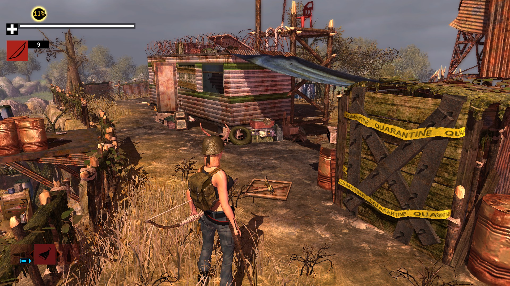

# Startopgave: 3rd Person Controller
I denne opgave skal du implementere en `3rd Person Controller` (se billedet). 

Vi har lavet en tom `ThirdPersonController` klasse i scenen `3rd Person Controller`, som du skal tilføje koden til.

## Opgaverne
1) Skriv kode, som tillader spilleren at bevæge sig rundt i verdenen med piletasterne eller WASD.
2) Rotere kameraet rundt om spilleren ved bevægelse af musen.