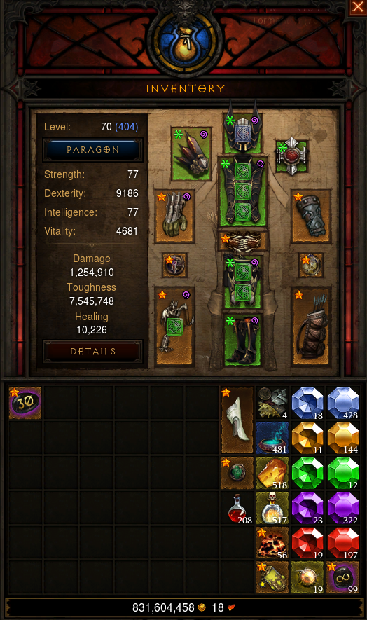

# Udstyr din Karakter

I denne opgaver skal vi udstyre vores karakter med rustning, våben og smykker. Hver af disse tilføjer en bonus til karakteren i en eller flere af de tre følgende attributter:
- Intellect
- Strength
- Agility

Spilleren kan være udstyret med følgende:
- Hjelm
- Amulet
- Rustning
- Skulderplader
- Bælte
- Busker
- Sko
- Handsker
- Ringe
- Våben

    

Spillerens rustning er delt op i fire grupper, som kan repræsenteres som sæt:
- Hoved (hjelm og amulet)
- Torso (rustning, skulderplader og bælte)
- Ben (Bukser og sko)
- Arme (Handsker, ringe og våben)

## Opgaverne
1) Sammenregn spillerens bonus i de tre attributer for alt hans rustning.
2) Forestil dig at rod-noden i hvert af de fire ovennævnte træer kan give en bonus til attributterne på de resterende stykker rustning.

    Eksempel: Hjelmen har give en attribut, som giver 15% ekstra strength på alt rustning i dens gruppe (den selv inkluderet). Hjelmen giver 100 strength og amuletten giver 50. Total strength skal udregnes som:

        (100 * 1.15) + (50 * 1.15) = 172.5 ~ 172

    Udregn spillerens attributbonusser efter tilføjelse af denne feature.
