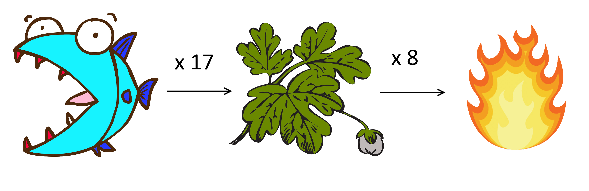

# Køb og Sælg - Styr dine resourcer

I denne opgave skal du lave et resourcesystem, som spillerne kan bruge til at købe og sælge ting i spillet. Resourcerne kan samles og splittes efter behov og består af:

1) Dild Sild
2) Mild Abild
3) Vildild

Resourcerne kan samles efter følgende omregnings priser:
- 17 x Dild Sild = 1 Mild Abild
- 8 x Mild Abild = 1 Vildild

## Opgaverne
1) Saml alle spillerens resourcer til så mange Vildild, som muligt.
2) Udregn om spilleren med sine resourcer kan købe en varer hos en sælger, der koster et givet antal Dild Sild, Mild Abild og Vildild.