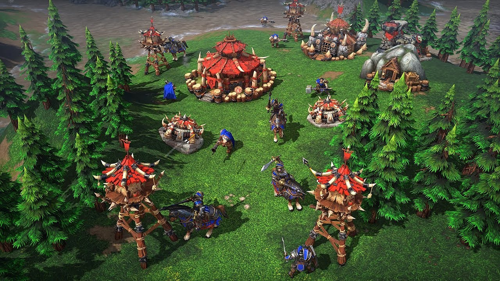

# AI i Strategispil

I denne opgave skal du lave en state machine, som repræsenterer en kamptrop i et realtidsstrategispil. Du vælger selv hvilken type kamptrop det skal være, men forsøg at begræns det til tre states. Et eksempel kunne være en bueskytte med følgende states:

- **Bevæg**: Spilleren har bedt bueskytten om at bevæge sig over til en ny position.
- **Angriber**: Bueskytten har set en fjende og angriber den.
- **Flygter**: Fjenden er kommet for tæt på og bueskytten løber væk.

Der er dog en hage: I stedet for at følge den klassiske tankegang om at hver kamptrop har sin egen state machine, skal du tænke på det som at en state machine har en samling af alle kamptropper som på nuværende tidspunkt er i den givne state. Det er derfor state machinen der sørger for at opdatere alle kamptropper i dens samling.

## Opgaverne
1) Implementer den omvendte state machine for din kamptrop.
2) Paralleliser løsningen.