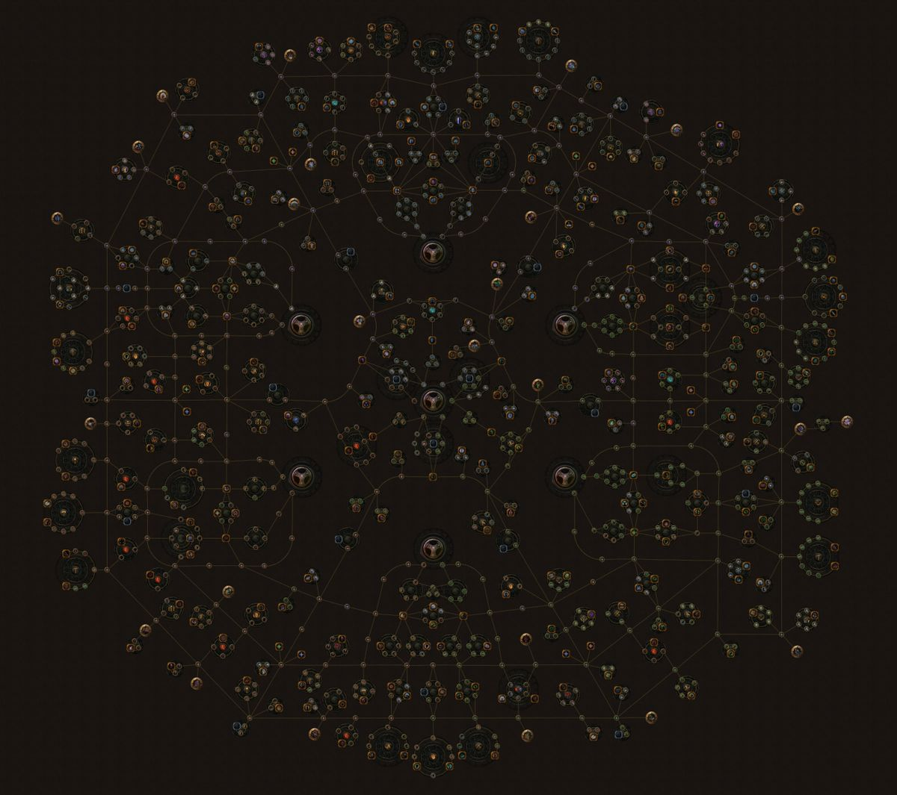

# Talenttræ
I denne opgave arbejder vi med talenttræer. Forestil dig et et træ med talenter eller skills, som hver især styrker spilleren. Dette træ består af `Node`s og `Leaf`s. En `Node` er en knude i træet som har børn og et `Leaf` er en `Node` uden børn. 

Hvert talent i træet giver spilleren en bonus i en eller flere af de følgende attributter:
- Intellect
- Strength
- Agility

Og hver `Node` i træet har en boolean `Picked`, som angiver om spilleren har burgt et point på talentet.

## Opgaverne
1) Gå igennem træet og sammenregn spillerens bonuser i de tre attributter. Et talent giver kun bonus, hvis det er `Picked`.
2) Udregn hvor meget bonus spilleren maksimalt kan få i en given attribut.