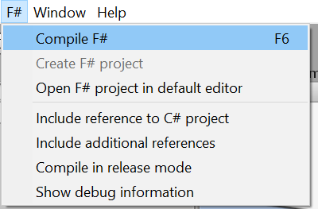

# Introduktion
Først og fremmest tak for din deltagelse i dette eksperiment. Vi vil starte med at understrege at eksperimentet ikke tester dine evner som programmør, men derimod hvor egnet F# og C# er til spiludvikling.

Der er i alt 8 opgaver i sættet, men det er ikke sikkert at du når at løse alle opgaverne. Halvdelen af tiden bliver brugt på at løse opgaver i F# og resten bliver brugt på C#. Det vigtigste er at du når at prøve kræfter med F#.

Du kan finde et [ark med eksempler fra F#](https://sppt-2019.github.io/unity-fsharp-introduction/), som du kan bruge som inspiration til opgaverne. Spørg endelig hvis du er i tvivl om hvad opgaverne går ud på eller hvis du føler at du er gået i stå.

Før du går igang med F# opgaverne, skal du installere en [Unity-pakke](https://sppt-2019.github.io/unity-fsharp-introduction/#brug-af-f-i-unity), som tilføjer menuen:

## Opgave 1
#### Basal bevægelse - `Player` - _Input management_
Lav et script som bevæger dit **rumskib** venstre og højre, når der trykkes på <kbd>A</kbd>/<kbd>D</kbd> og <kbd>←</kbd>/<kbd>→</kbd>.

Spilleren skal ikke kunne gå udenfor skærm-området.

___
 

## Opgave 2
#### Skydning del 1 - `Player` - _Input management, Events_
Lav et event på spiller-klassen, som bliver "_raised_" når der trykkes på knappen `Fire` trykkes på.

___
 

## Opgave 3
#### Skidning del 2 - `Player` - _Events, Audio management_
Tilføj en _handler_ til eventet fra opgave 2, som afspiller det inkluderede lydklip `Shoot`

___
 

## Opgave 4
#### Skydning del 3 - `Bullet` - _Events, Vector math_
Tilføj endnu en _handler_ til eventet fra opgave 2, som denne gang `Instantierer` **bullet**-prefabbet og sender det fremad, så det ligner den bliver skudt afsted.