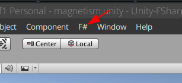

<span style="float: right"><b><a href="/unity-fsharp-introduction/">🇩🇰</a></b>/🇬🇧</span>

## General information about F#
F# is a programming language of the functional paradigm, and runs on the .NET platform together with C# and VB.NET.
Since F# is in the functional paradigm, almost everything is considered functions and functioncalls. F# is by default _pure_ which means that the value of a variable cannot be changed after they are declared.
F#'s syntax is heavily inspired by OCaml and Haskell, and is indentation-based instead of using curly braces ( `{` og `}` ).

An important thing be aware of is that F# uses explicit membership instead of implicit, as we know it from C#.
That means that it always is necessary to use `this` when working member fields and -functions. This also means that when calling a inherited static function, it is necassary to use the name of the class containing it aswell. A Unity example of this is `Destroy` which is a static function of `GameObject`. To call it from any class inheriting from `MonoBehaviour`, we need to use `GameObject.Destroy(..)` instead of just `Destroy(..)`.


This documenent gives a quick introduction to F# and basic of F# in Unity.

___
## Datatypes and variables
All datatypes we know from C# can also be used in F#. Declaration of variables is almost the same as in C#, but we use `let` instead of `var`:
```fsharp
let a = 5             // Integer variable
let mutable b = 5.0f  // Mutable float32 variable
let c = "John"        // String variable
let d:bool = true     // Explicitly typed boolean variable
let e:float = 4.2     // Explicitly typed float64 (double) variable
```
_A `mutable` variable can be assigned with a new value, which is not possible without it being `mutable`_

### Editor variables
If you need to declare a variable that can be set/changed from the Unity Editor, it has to be both __mutable__ and __serializable__:
```fsharp
[<SerializeField>]
let mutable Variable = 5.0f
```
Sometimes it might be practical to omit assigning a value at declaration time. For that, the `DefaultValue`-attribute will allow omitting the value and assigns the field the default value of the type specified.
```fsharp
[<DefaultValue>]
val mutable Variable:float32
```

___
## Type casting and conversion
Since F# is a strongly typed language, you will often have to cast or convert a numeric value of a given type to another numeric type.
A common example from Unity F# development, is the conversion of an `int` to a `float32`:
```fsharp
let i = 14
let f = float32 i
```
_In F#, all conversions and casts needs to be explicit. F.x. `int` to `float32`_

___
## Declaration of types (classes)
```fsharp
open UnityEngine

type MyType() =
    inherit MonoBehaviour()

    [<SerializeField>]
    let mutable Message = "Hello from F#"

    member this.Start() =
        Debug.Log("MonoBehaviour says: " + Message)
```
The above snippet declares a type called `MyType` which inherits from `MonoBehaviour`. The type has a member-field, `Message`, which is printed to the debug log when the game is started.
The `SerializeField`-attribute makes it possible to change it field from the Unity Editor.

<div class="note-box">
    To inherit from <code>MonoBehaviour</code>, you have to <i>open</i> UnityEngine ( <code>open UnityEngine</code> ), just like you would slap a `using` directive with <code>MonoBehaviour</code> at the top of your C# files. In C# we <b><i>use</i></b> libraries, and in F# we <b><i>open</i></b> libraries
</div>

___
## Functions and methods
F# supports both functions and methods. F# functions are not associated with any type, and can exists on their own in a module. In C#, the closest thing to functions are the static member methods, which should be considered functions and not methods, since they do **not** operate on an instance. Calling and declaring methods in F# requires the explicit use of `this`. 

### Functions
Here we declare a function that takes a list of floats as input, calculates the power of `n` of each and then sums them.
```fsharp
let sumInPowerN (nums:float32 list) (n:float32) =
    List.reduce (fun acc i -> acc + Mathf.Pow(i, n)) nums
```
In F#, it is often not necessary to be explicit about the types as it has decent type inference. Sometimes it is necessary, because the current usage of a function or field isn't enought for the compiler to be able to infer the types.
```fsharp
let sumInPowerN nums n = [...]
```

### Currying
F# uses currying when calling functions. Suppose we have the following F# function, which takes a list and a function that is run on all the elements:
```fsharp
let rec executeOnElements list func =
    match list with
    | [] -> ()
    | h::t ->
        func h
        executeOnElements t func
```
We can curry this function and thus create a new function that performs an action on all numbers from 1 through 100:
```fsharp
let doFrom1To100 = executeOnElements [1..100]
```
This means that if you call a function with too few arguments, it will not give an error that you might know it from C#, but instead return a new feature that accepts the remaining arguments and then gives the final result

Our new function can now be used as follows:
```fsharp
doFrom1To100 (fun i -> printfn "%d" i)

doFrom1To100 (fun i -> printfn "%d" (i * 5))
```
Which prints all numbers from 1 to 100 and then the first 100 numbers in the 5 multiplication table.
_Read more about currying [here](https://fsharpforfunandprofit.com/posts/currying/)_

### Method

Methods are declared on a type and works the same as methods in C#.

```fsharp
type MoveForward() =
    inherit MonoBehaviour()

    [<SerializeField>]
    let mutable Speed = 8.0f

    member this.Update() =
        this.transform.position <- this.transform.position + (this.transform.forward * Speed * Time.deltaTime)
```

### Unity-specific methods
Below are some examples on Unity-specifik methods that might be useful for you.

#### Instantiation
Instantiating Unity-object are the same in F# as in C#, although you have to explicitly call it on the `GameObject`:
```fsharp
    //Type 'GameObject' using casting
    let gObj = GameObject.Instantiate(prefab, this.transform.position, Quaternion.identity) as GameObject
```
```fsharp
    //Type 'GameObject' using generics
    let gameObject = GameObject.Instantiate<GameObject>(prefab, this.transform.position, Quaternion.identity)
```

#### Component references
As in C#, there are two ways to get references to Components: In the editor with `[<SerializeField>]` eller i koden med `GetComponent<T>`.

```fsharp
    // Must be set in the Unity Editor
    [<SerializeField>]
    let mutable myRigidbody:Rigidbody2D = null
```

```fsharp
    // Must be set in code
    let mutable myRigidbody:Rigidbody2D = null

    member this.Start() =
        myRigidbody <- this.GetComponent<Rigidbody2D>()
```
<!--
#### MonoBehaviour Messages
Metoder som `Awake`, `Start` og `Update` og Kollision-metoder er alle kaldt Messages i Unity. Det samme gælder for f.eks collision metoder, derfor skal de alle defineres på samme måde. Du kan finde en liste af disse metoder på [Unitys dokumentation for MonoBehaviour](https://docs.unity3d.com/ScriptReference/MonoBehaviour.html). Her giver vi eksempler på `OnCollisionEnter2D` og `OnMouseDown`

```fsharp
member this.OnCollisionEnter2D(collision:Collision2D) =
    if collision.gameObject.CompareTag("Player") then
        Debug.Log "Ramte spiller, du tabte!"
    else
        let msg = sprintf "Ramte en %s" collision.gameObject.tag
        Debug.Log msg
```

```fsharp
member this.OnMouseDown() =
        SceneManager.LoadScene("Min scene")
```
-->
___
## Control structures

### If-then-else
If-else control structures can be found in F#:
```fsharp
type Foods =
    | Strawberry
    | IceCream
    | Sandwiches
    | Pizza

let GetFoodMessage food =
    if food = Strawberry then
        "I see you like fruit"
    elif food = IceCream then
        "So you have a sweet tooth? Watch you weight!"
    else
        "There are so many options when it comes to food."
```
In many of these examples one could also use pattern matching, which can provide a more elegant solution.

_Read more about if-then-else in F# [here](https://fsharpforfunandprofit.com/posts/control-flow-expressions/#if-then-else)_


### Pattern Matching
Pattern matching can be described as if-else statements on steroids. You can use them to match variables, tuples, classes, etc.

#### Simpel pattern matching
```fsharp
let GetFoodMessagePM food =
    match food with
    | Strawberry -> "I see you like fruit"
    | IceCream -> "So you have a sweet tooth? Watch you weight!"
    | _ -> "There are so many options when it comes to food."
```
This is a simple example, which is equivalent to the above example above.

Now imagine that we have tuples of food and the number of types of food a person has eaten every day:

#### Pattern matching on lists
```fsharp
let diet = [(IceCream,20);(Sandwiches,0)]
match diet with
| [(IceCream,0);(Sandwiches,x)] when x > 0 -> "Healthy diet with no ice cream and sandwiches"
| [(IceCream,y);(Sandwiches,0)] when y > 0 -> "More sandwiches and less ice cream!"
| [(Pizza,z)] when z > 0 -> "I hope that pizza was made from whole-grain flour!"
| _ -> "Nothing special to notice about your diet"
```

Alternatively, the list can also be treated as a `head` and a `tail` through recursion:
```fsharp
let rec GetFoodMessageRec diet =
    match list with
    | [] -> ""
    | (IceCream,x)::t when x > 0  -> "Less IceCream" + (GetFoodMessage t)
    | (Sandwiches,0)::t -> "More Sandwiches" + (GetFoodMessage t)
    | (f, q) -> (sprintf "You diet of %d %ss is fine" q f.ToStrings) + (GetFoodMessage t)
```

#### Pattern matching on types
Pattern matching can also match on types, which you will probably need in the tasks. This example shows how:

```fsharp
type Weather =
| Snowing of cmOfSnow:int * temp:float32
| Sunny of temp:float32
| Storm of windSpeed:int * temp:float32

let weatherAnnouncement w =
    match w with
    | Snowing (s,t) -> sprintf "%d cm of snow has fallen and it's %f degrees outside" s t
    | Sunny (t) -> sprintf "Sun's high in the sky and it's %f degrees outside" t
    | Storm (w,t) -> sprintf "Stay inside, as winds are reaching %d m/s with a temperature of %f" w f
```

Pattern matching is a very powerful tool, but also a little too comprehensive to review on this sheet. _Read more about it [here](https://fsharpforfunandprofit.com/posts/match-expression/)_


### Loops and ranges
There are also loops in F#. These are closely linked to the ranges, so we present both at the same time:
```fsharp
let mutable sum = 0
for i in 1 .. 3 do
    sum <- sum + i
```
In this example, `1 .. 3` is a range that will return the list consisting of numbers 1, 2 and 3. The syntax itself and the way the loop works are very similar to `foreach` loops from C#, or loops and ranges from Python. Ranges can also be used to declare lists:
```fsharp
let oneToHundred = [1..100]
```

<div class="note-box">
The blog <i>F# for Fun and Profit</i> recommends avoiding loops and instead using some of the other List methods, eg. List.iter.

<i>Read more about how to use, and avoid using, loops in F# <a href="https://fsharpforfunandprofit.com/posts/control-flow-expressions/#loops">here</a></i>
</div>

___
## F# Operators
Most operators you know from C# are also found in F#. However, there are a few exceptions that we go through here:

### Assignment vs. Boolean Expressions
In C# you are probably used to writing `=` as an assignment and `==` as a boolean comparison. In F# things are slightly different, here `=` is used for declarations with the `let` operator and `<-` as assignment when we want to overwrite a variable (only works on `mutable` variables). In boolean terms we use `=` as boolean equality:
```fsharp
let mutable i = 10
if i = 8 then
    i <- 0
else
    i <- i + 1
```

<div class="note-box">
The blog <i>F# for Fun and Profit</i> recommends avoiding mutable variables in F# as far as possible.
</div>

<div class="note-box">
Compound operators (+ =, * = etc.) are not found in F#, as we basically do not overwrite variables.
</div>

### Pipe operatoren
In an earlier example, we saw the pipe operator (`|>`) in use.

This operator is especially smart when working with collections of objects or values. In short, it takes the value on the left hand and uses as the last argument in the function on the right hand. In this example we find all `GameObject`s with the tag `Movable` and calculate their midpoint:
```fsharp
[1..5]
|> List.map (fun i -> float32(i))
|> List.map (fun f -> f ** 2.0f)
|> List.reduce (fun acc elm -> acc + elm)
```
The following is an explanation of each step:

1. `[1..5]` is a range that declares a list of integers from 1 through 5 inclusive.
2. `List.map (fun i -> float32 (i))` transforms the list of integers into a list of floats.
3. `List.map (fun f -> f ** 2.0f)` raises all the items in the list to another power.
4. `List.reduce (fun acc elm -> acc + elm)` summarizes all the numbers in the list.

There is also an operator to pipe backwards (`<|`), but it should not be needed in this task.

### Tuple Operator
You should be aware that when the `*` operator is used in declarations, it does not mean times. Instead, it is used as a pairing operator, which means that the right and left sides of the operator are put together as a new tuple.

```fsharp
let t1:int*float = (2, 3.14)
```
The above declares a tuple with the first element as integer and other element as a float.
___
## Map-reduce
Two important concepts in functional programming, which we have touched a little on here, are map and reduce. Both concepts deal with collections. **Map** transforms all elements in a list and returns a new collection and **reduce** reduces all elements of a collection to one element.

For example, we can use the map to calculate the square of all elements of a list:
```fsharp
let sqList = [1..5] |> List.map (fun i -> float32(i) ** 2.0f)
```
And reduce to sum all the items in the list:
```fsharp
let sum = [1..10] |> List.reduce (fun acc elm -> acc + elm)
```
There are also inbuilt functions for common functionality such as sum on the `List`, `Array` and `Seq` types:
```fsharp
let sum = [1..10] |> List.sum
```


___
## Events
Events work approximately in the same way as in C#. However, an event must always have an argument with it. So when you are not interested in making an argument, you use either `unit` or wildcard `_` (you can ignore the type).
```fsharp
    let event = new Event<_>()
    let Event = event.Publish
    
    let eventMedParameter = new Event<GameObject>()
    let EventMedParameter = eventMedParameter.Publish
```

Handlers must be added as a function. If your function does not use parameters (such as `myEventHandler` below), it must have unit `()` with whatever.
If, on the other hand, you are interested in providing a parameter, you can use a lambda expression, see where `myParameterEventHandler` is added, after `Debug.Log` in `Start`.
```fsharp
let handleEvent () =
        Debug.Log("Raised empty event!")

let handleEventMedParameter gameObject =
        Debug.Log(gameObject.name)   
       
member this.Start() =
    Event.AddHandler(Handler<_>(handleEvent))
    EventMedParameter.AddHandler(Handler<GameObject>(handleEventMedParameter))
```
To raise or trigger an event is called `.Trigger (...)` at the event.
```fsharp
member this.Update() =
    if(Input.GetButtonDown("Jump")) then
        event.Trigger()                         //Ingen parameter (altså et event<unit>
        eventMedParameter.Trigger(somePrefab)   //Parameter med typen GameObject
```
Alternativt kan du bruge lambda-funktioner til at tilføje event-handlers:
```fsharp
member this.Start() =
    Event.AddHandler(Handler<_>(fun _ e -> Debug.Log("event triggered")))
    EventMedParameter.AddHandler(Handler<GameObject>(fun _ g -> Debug.Log(g.name)))
```

___
## Using F# in Unity
Unity does not support the use of F# as it supports C#. But because both languages run in .NET/Mono, F# projects can be used - though with a little extra work.
To automate as much of this work as possible, we have developed a Unity package that adds a menu of features to this.

[Download the Unity-package for F# integration](https://github.com/sppt-2k19/unity-fsharp-integration/raw/master/unity-fsharp-integration.unitypackage "Download the package") ([read more about the package](https://github.com/sppt-2k19/unity-fsharp-integration "Read more here"))



___
<!--
## FRP i Unity
Functional Reactive Programming(FRP) er en måde at programmere funktionelt, som kan være lettere at bruge til spilprogrammering end almindelig funktionel programmering.

[Læs om FRP](frp.md)

___
-->


## Concurrency

Concurrency is a quite comprehensive topic and we have therefore made separate files.

[Læs om concurrency i C#](csharp-concurrency.md)

[Læs om concurrency i F#](fsharp-concurrency.md)
